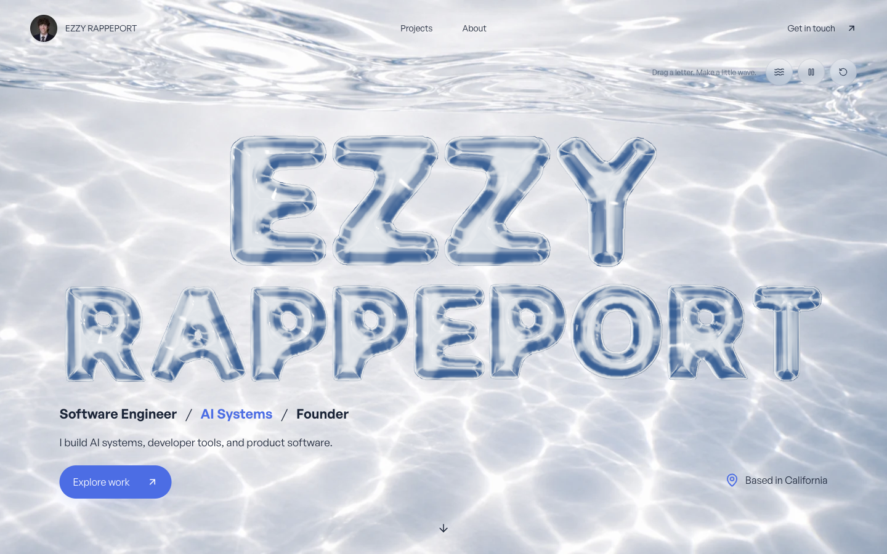
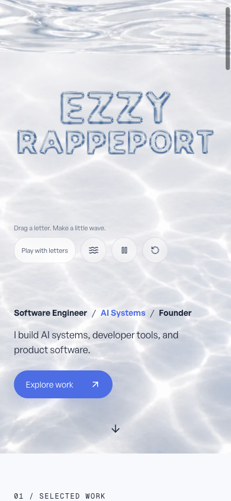

# Glass finish — local evidence

## Result

Smoothed the glass reflections, replaced the HDR download with a procedural studio, and retained the existing rounded GLB and all 13 draggable letters. A browser-rendered transparent poster now uses the same optics as the live scene, replacing the visibly different Blender poster. Its encoded size is 92,710 bytes. No Blender regeneration was necessary; source assets remain available. This is a visual refinement toward the supplied reference, not an identical reproduction.

The responsive camera derives its framing from the poster element. Desktop height limits keep the title above the introduction. Adaptive resolution now observes both active and idle frame intervals, with separate budgets and resets between modes.

## Browser checks

Tested the current checkout in the Codex in-app WebGL browser at 1440×900, 390×844, and 1920×780. Desktop/mobile/wide layouts have no horizontal overflow. Visually compared live glass with the matching poster, including a context-loss transition. The wide layout retained its title position and lighting when the canvas was removed.

- Wave, drag/release, reset, and pause/resume were exercised locally.
- Pause held the diagnostic render count at 880 across separate reads. Offscreen held it at 891 across separate reads.
- Mobile defaults to `touch-action: pan-y`; Play with letters changes it to `none`, and Back to scrolling restores scrolling.
- Reduced motion removed the canvas and retained the loaded poster. Disabling it initialized the canvas again.
- `WEBGL_lose_context` removed the canvas, set readiness false, and retained the loaded poster and readable page. Recovery is the static fallback; a reload starts a new renderer.

## Performance

At 1440×900, DPR 1, 28 draw calls, and 124,804 rendered triangles, the opt-in sampler recorded 180 samples per mode:

| Mode | Frame interval median / p95 | CPU submission p95 | GPU p95 |
| --- | --- | --- | --- |
| Interaction | 16.7 / 18.4 ms | 0.5 ms | 7.52 ms |
| Idle | 33.3 / 33.5 ms | 0.5 ms | 8.92 ms |

GPU times come from supported disjoint timer queries. These measurements describe this machine and browser; they do not establish physical-phone, Safari, or universal frame-rate performance.

## Validation

Final `npm run typecheck`, `npm run lint`, `npm run test:playground`, `npm run build`, and `git diff --check` pass. The resulting production server passed nine routes, 32 image/script/download assets, section anchors, and unknown-project 404 checks. Its live WebGL homepage was visually inspected after the build: one ready canvas and no horizontal overflow. The retained legacy portfolio suite has a pre-existing punctuation assertion failure in unchanged content, documented in the import review.

## Screenshots

No commit, push, deployment, or domain changes were performed.
