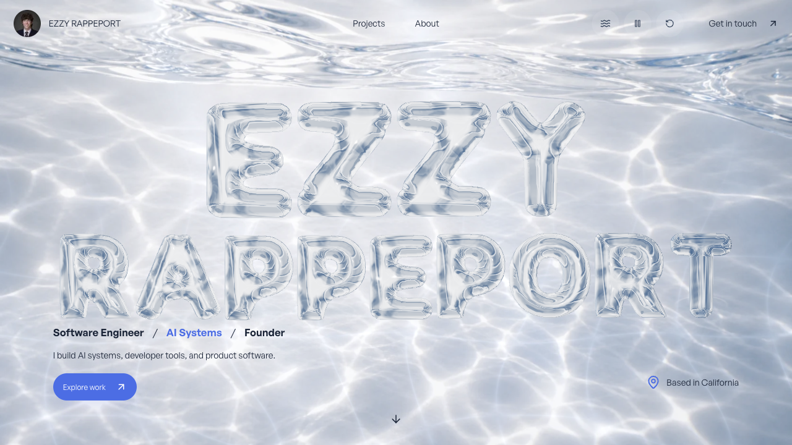
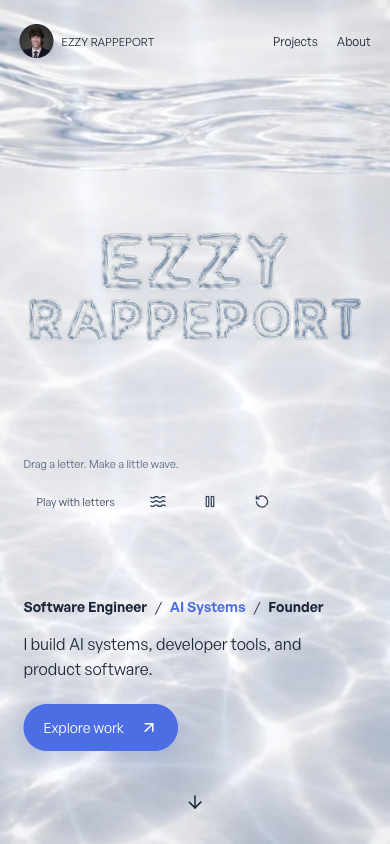

# Immersive hero follow-up

The user clarified that the supplied image is an atmospheric reference, not a pixel-by-pixel layout target. This pass makes the scene feel more spatial while preserving readable content and normal navigation.

## Changes

- Clearer glass transmission and narrower shoulder reflections replace the previous broad, blue-filled treatment.
- Slow floor-light drift, soft shafts, and a restrained depth grade complement the existing interactive wave field.
- A small pointer-driven camera tilt reveals the letters' depth. The water stays full-viewport without exposed edges.
- One instanced contact-light draw adds soft grounding shadows and light beneath the letters; it adds 26 triangles, not a shadow-map pass.
- Desktop water controls sit quietly beside the navigation; touch play remains explicit. Smaller secondary UI leaves more room for the scene.
- The same-renderer fallback poster was regenerated, including contact light. Encoded size: 155,386 bytes. Shader provenance passes.

The original rounded geometry remains intact. An experimental flattened face produced visible creases and was removed after browser comparison.

## Browser evidence

The current checkout was inspected in the Codex in-app WebGL browser at 1280×720 and 390×844. Tested drag/release, reset, pause/resume, relocated header controls, and touch opt-in. Mobile has no horizontal overflow. Once play mode is enabled, touch dragging keeps the page's scroll position unchanged. Reduced motion removes the canvas, retains a loaded matching poster, and preserves composition.

The new scene reports 29 draw calls and 124,830 triangles, compared with the previous 28 and 124,804. An interaction sample at DPR 1 reported a 16.7ms median frame interval and GPU p95 of 11.63ms. Idle samples were less stable (33.3ms median, approximately 50ms p95), and adaptive resolution reduced DPR to 0.8 during this session. These are local development measurements under concurrent tool activity, not a sustained frame-rate claim or physical-phone/Safari evidence.

During verification a concurrent build disrupted the dev server's generated manifests. The server was restarted and browser checks resumed. The final build is run separately with the dev server stopped.

## Final validation

`npm run typecheck`, `npm run lint`, `npm run test:playground`, `npm run build`, and `git diff --check` pass. The isolated production build generated all 31 pages. Its server passed the nine-route, 32-asset, anchor, and unknown-project checks. The live production hero was inspected and exercised with wave/drag controls.

A fresh production run at 1280×720, DPR 1 collected 180 samples per mode: interaction frame interval median/p95 16.7/17.6ms, CPU p95 0.9ms, GPU p95 6.8ms; idle median/p95 33.3/50ms, CPU p95 0.6ms, GPU p95 7.74ms. DPR remained 1. The idle jitter remains visible in the measurements; no universal frame-rate guarantee is made.

No commit, push, deployment, or hosting changes were performed.
