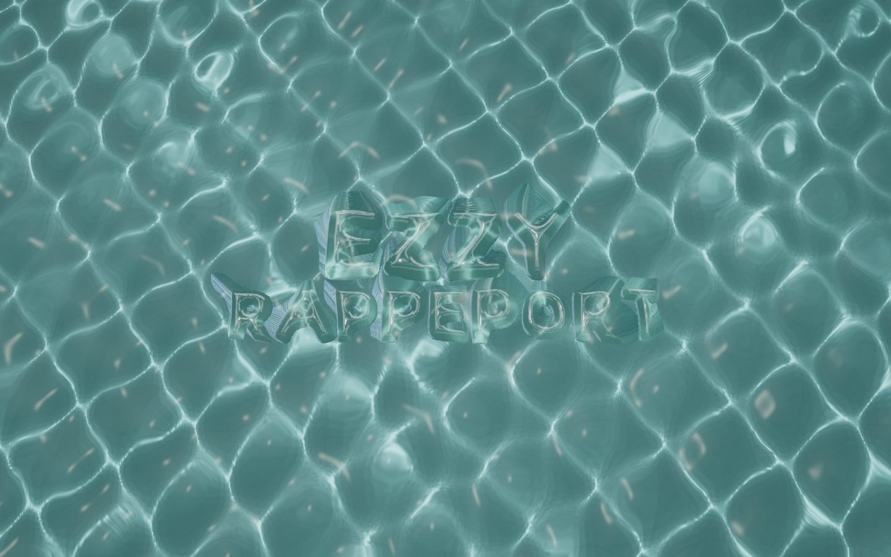
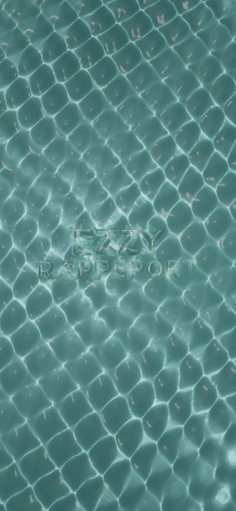
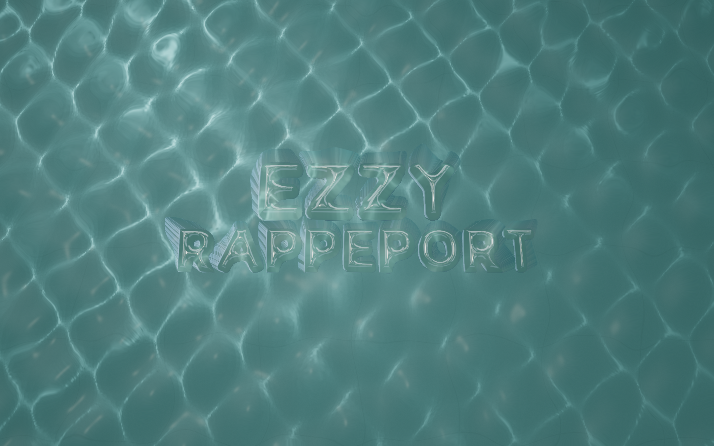
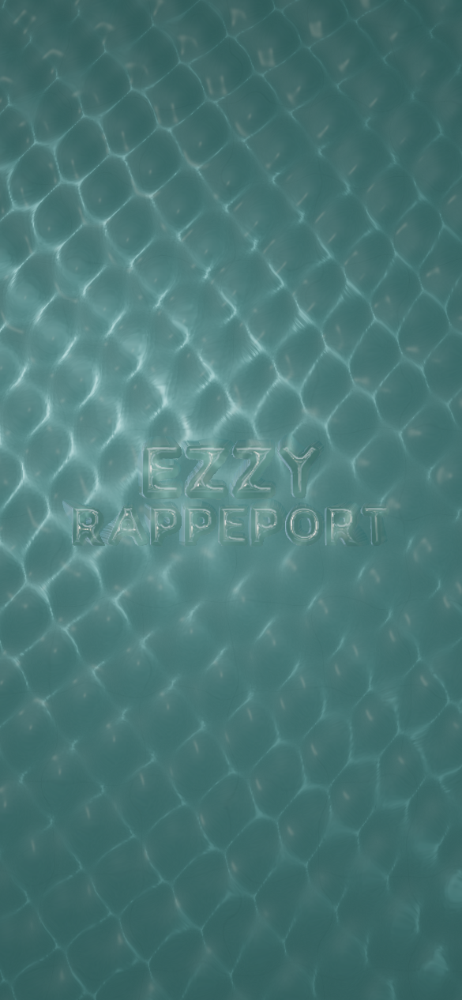
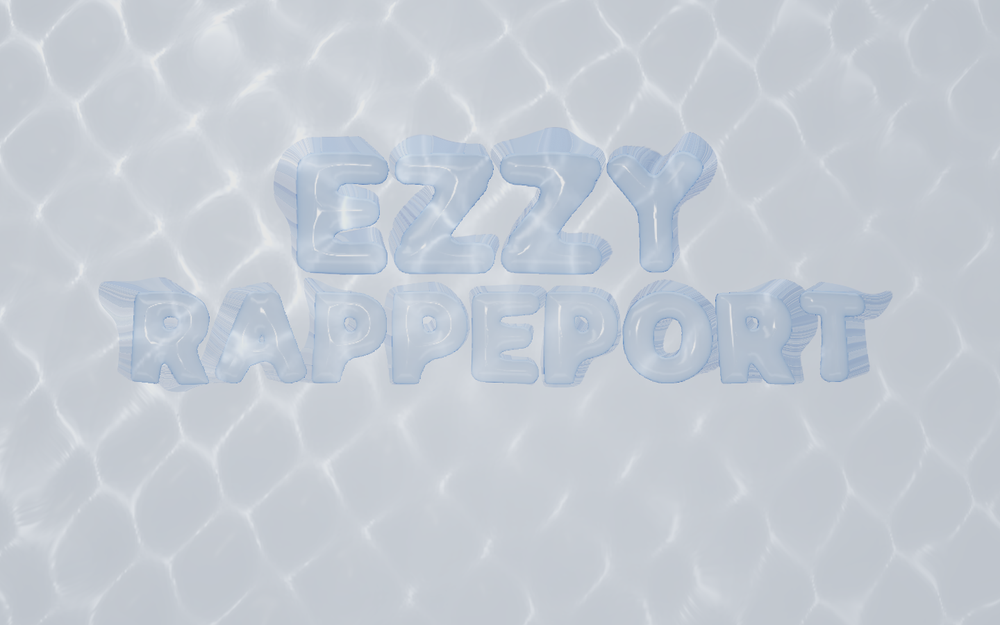
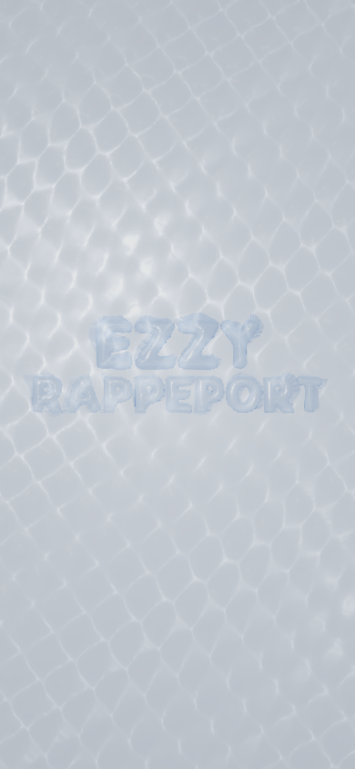

# Water optical prototype

The user approved a separate rendering prototype after the prior water treatment looked like independently moving layers. The existing homepage is unchanged by this pass; the new route is `/water-study`.

## Rendering

The live scene does not sample a water photograph. A shared world-space height function combines the existing CPU pressure field with low-amplitude traveling waves. It displaces a 256×320 surface grid and supplies normals to both refraction and light projection. A 1024² caustic target projects refracted sunlight onto a floor; its intensity follows the ratio of surface and projected areas. The submerged floor and glass are rendered into a color/depth target at 85% of drawing-buffer resolution. A 24-step screen-space ray march resolves submerged receivers for the final water pass. Fresnel reflection and distance-based color absorption finish the water.

The glass uses a physical transmission material and the same projected light texture. It does not use the homepage's animated shoulder stripes. Refracted pointer rays select submerged glyphs; dragging injects pressure with elapsed-time scaling. Touch pressure/dragging requires explicit play mode. Scrolling changes the camera angle.

This is an optical prototype, not a volumetric fluid or path-traced renderer. The pressure solver remains on the CPU. Refraction only sees geometry in the scene color/depth target; hidden/offscreen surfaces cannot be recovered. Reflection uses a procedural environment, and glass light projection approximates the floor caustic footprint. Those are explicit limitations, not full physical-light-transport claims.

## Browser evidence

Reviewed at 1440×900 and 390×844 in the in-app WebGL2 browser. Desktop picking selected `line1_E_00` at its visible refracted location; dragging displaced it and changed the surrounding water/light pattern. Touch play kept scroll at zero during a drag and used `touch-action: none`; leaving play restored native scroll mode. Pause/reset and initial reduced-motion pause were exercised. Graphics-context loss removed the canvas and showed the successfully loaded matching poster. Phone framing was corrected after the initial surface ended inside the viewport.

The final production prototype at 1440×900, DPR 1 collected 180 samples during ambient motion: frame interval median/p95 16.7/17.4ms, CPU p95 0.2ms, GPU p95 13.53ms. It reports 17 draws and 390,084 triangles across all passes. This is a local observation, not a sustained dragging, high-DPR, or physical-phone guarantee.

Save-Data was also exercised through client navigation: it produced zero canvases and the static-view message. Choosing the explicit load button initialized one canvas. The temporary browser override was removed and the normal page reloaded. Physical phones and Safari have not been tested.

## Checks

Refraction tests pass Snell's law, unit direction length, total internal reflection, pressure response, and reset. Existing playground/wave tests and lint pass. The production build passed and generated 32 pages. Standalone typecheck passed. Production HTTP checks passed the existing nine routes/33 assets and the new study route/two fallback images, including the noindex directive.

Matching desktop and mobile WebPs were captured from the resting final renderer. Temporary capture API and PNG working files were removed. The final preview hides the export controls.

No commit, push, or deployment was performed. The live local production preview is available at `/water-study`.

## Composition and motion refinement

The next authorized pass concentrates floor illumination near one opening, reduces ambient wave amplitude around the lettering, and lowers the scattered sun highlights. Glass sits closer to the surface with clearer transmission. Four binary refinement steps follow the depth march to reduce stepping at refraction intersections. Pointer picking uses the same calm-region height function as the shader.

Dragging now uses mass-dependent springs and stronger damping. Moving letters leave two trailing pressure lobes beside their wake; force remains scaled by elapsed time. Pointer-driven camera movement follows an exponential ease instead of moving directly with each pointer event. The scroll view uses a slightly stronger change in viewing angle.

Desktop and phone rendering, drag/release, pause, and reset were reviewed again. Matching static images were regenerated from the resting scene. The initial screenshots and measurements above are retained as historical prototype evidence.

Refinement checks passed: lint, typecheck, optical tests, existing playground/wave tests, diff whitespace check, and the 32-page production build. The study route and both updated fallback assets return HTTP 200. Production pause/reset/resume were exercised. At 1440×900, DPR 1, the refined production renderer recorded 180 ambient-motion samples: frame interval median/p95 16.7/17.7ms, CPU p95 0.3ms, GPU p95 12.66ms. These remain local measurements. Browser overrides and capture controls were cleared from the final preview.

## Silver palette and connected lettering

The original supplied reference was reopened for this pass: pale silver-blue water, clear rounded lettering, and blue-white reflections. The study's teal floor, tiled seams, and grain were replaced with a smooth pale mineral floor; water absorption, glass attenuation, studio reflection colors, and interface contrast were reworked together. Lettering is larger and shallower, with room above the caption. The darker blue glass edges use an explicit grazing-path absorption approximation; the renderer still has the screen-space limitations described above.

A shared traveling wave now supplies lateral force, lift, and tilt to letters. Springs are mass-dependent, damping returns them to rest, and rounded-body contact transfers impulses during collisions. Drag wakes act on neighboring letters. Clicking the surface and the keyboard-accessible “Make a ripple” button disturb the same field. A live browser ripple test measured peak local displacement 0.1303 and tilt 0.1361 radians during a 2.5-second window. An isolated coupled simulation verifies delayed arrival, visible displacement, smaller movement for greater mass, bounded feedback, and settling within 0.005 world units after ten seconds.

Rendering work was reduced from 390,084 to 250,820 triangles by using a separate 96×128 visible surface while retaining the dense caustic projection mesh. The caustic target is now 768² instead of 1024². Active interaction presents at up to 60Hz; idle motion presents at 30Hz. A 2.2-million-pixel cap and the existing sustained-frame budget reduce resolution on overloaded devices. These controls preserve the 24-step refraction and four-step hit refinement.

Desktop and phone views, ripple response, touch play, pause, and reset were exercised again. Phone width remains 390 CSS pixels with no horizontal overflow; touch play keeps scroll at zero. Both static fallback images were regenerated, and temporary capture tooling was removed before the final build.

Final silver/interaction validation: lint, standalone typecheck, optical and coupled-wave tests, existing playground/wave tests, diff whitespace check, and the 32-page production build pass. The existing nine-route/asset HTTP checks and the study route/two fallback images pass. A fresh production preview verified picking `line1_E_00`, dragging, pause, and reset. A steady active sample at the native 665×837 view (DPR 1.5) reported interval median/p95 16.7/33.3ms and GPU p95 11.72ms; an earlier idle sample at 1280×720 (DPR 1.5) reported 33.4/50ms and GPU p95 14.67ms. The preview viewport changed during the session, so these are not a controlled before/after speed comparison. The objective rendering reductions are 35.7% fewer triangles and a 43.75% smaller caustic target, plus half-rate idle presentation. Physical-device and Safari performance remain unverified.

## Continuous optics and depth refinement

The current renderer supersedes the earlier mesh and resolution settings above. Water and caustics now use continuous fragment calculations on fullscreen quads; the shared six-wave surface uses half-float height and slope data. This removes triangle-lattice caustics and quantized small ripples. Refraction rejects false depth hits that previously stretched letter silhouettes into striped walls, and skips glass tracing outside its projected bounds.

The submerged color/depth and refracted image render at full drawing-buffer resolution (DPR up to 2, capped at 3.2 million pixels), followed by FXAA. Overload reduces the caustic target only. Floor lighting uses depth-based mip filtering before glass composition, preserving letter edges without blur halos. This is selective background defocus, not full photographic depth of field. Glass refraction remains a screen-space approximation and cannot reconstruct hidden geometry.

Desktop 1440×900 and phone 390×844 captures were visually reviewed; ripple, drag, pause and reset paths were exercised. Current rest-pose fallback assets were exported from the renderer. Evidence: `water-study-depth-desktop.png` and `water-study-depth-mobile.png`. Optical/half-float precision and coupled-wave tests, playground tests, lint and typecheck passed. Temporary capture endpoint removed.

Production build passed (32 pages). Final local Chromium measurement at verified 1440×900, DPR 1, 180 samples per mode: 18 calls / 62,410 triangles; active while holding E: median frame interval 16.7 ms, p95 33.3 ms, GPU p95 7.15 ms, CPU p95 1.5 ms. Idle: median 33.4 ms, p95 50 ms, GPU p95 9.6 ms. Triangle count is 75.1% below the prior 250,820; this does not imply an equivalent frame-time improvement. Missed frames remain, and high-DPR physical phone/Safari performance is not verified.

## Portfolio opening and editorial transition

The study route now contains a portfolio opening and four selected case studies using the existing content/catalog sources. The camera is oblique, the lettering rotated slightly in the composition and its physical thickness restored. Glass uses near-neutral transmission (roughness .012, attenuation distance 8) without additive blue caustic glow. Narrower environment cards supply edge reflections. A 512px projected, filtered shadow field gives the glass separation from the floor; this is an art-directed approximation, not refractive shadow transport. The shadow geometry pass is cached while its world transforms and coverage remain unchanged.

Pointer disturbances are smaller; clicking and dragging retain wave coupling. Demo controls move into an accessible Scene settings disclosure. Explore my work scrolls into an editorial project gallery. The renderer suspends when the opening is fully faded and releases pointer capture. The document transition runs independently of WebGL so fallback content and project navigation remain available.

Desktop and phone compositions and the project gallery were visually inspected. Project navigation to MonkeyClaw was exercised. Rest-pose assets updated (`water-study-editorial-desktop.png`, `water-study-editorial-mobile.png`). Existing optical/coupling, spring/contact, and water-field tests passed. A standalone typecheck initially encountered stale generated types for the removed temporary capture endpoint; the clean production build regenerates those types. Earlier screenshot/performance sections remain historical.

Final production verification: build (32 pages), regenerated standalone typecheck and lint passed. At 1440×900 / DPR 1, 180 active samples while holding E measured a 16.7 ms median / 33.3 ms p95 frame interval, 7.17 ms GPU p95, and 1.6 ms CPU p95. Moving glass uses 31 calls / 124,810 triangles including its shadow. This is not a steady-60-FPS claim. After Explore my work, diagnostics reported `offscreen` and the render counter stayed exactly 657 over a one-second observation. Reduced motion showed Resume motion; forced context loss removed the canvas and retained the matching poster, introduction, and project navigation. Physical-device performance remains unverified.

## September 7: reflection detail and deforming waves

Replaced the four studio panels with a fixed HDR procedural opening containing irregular light folds. The environment is generated once; reflections respond to the glass geometry and camera. Increased optical thickness to .95 and IOR to 1.58, with stronger reflection intensity and a larger desktop title. The ambient surface now uses a slow cross-current coordinate deformation shared with CPU picking; the GLSL gradient includes its chain-rule derivative. Floor illumination has more local contrast.

Current captures: `water-study-reflections-desktop.png` and `water-study-reflections-mobile.png`; both fallback WebPs updated. Desktop and phone framing, drag, pause/reset, and shader compilation visually checked. Typecheck, lint, optical/coupling tests, playground/water-field tests, and production build passed. A final production sample while holding E at 1440×900 / DPR 1 recorded 180 active samples: frame interval median 16.7 ms, p95 17.3 ms; GPU p95 12.84 ms; CPU p95 3.1 ms. Idle median 33.3 ms, p95 33.8 ms. These are local observations, not a physical-phone or cross-device guarantee. Screen-space refraction and approximate glass shadows remain limitations.
