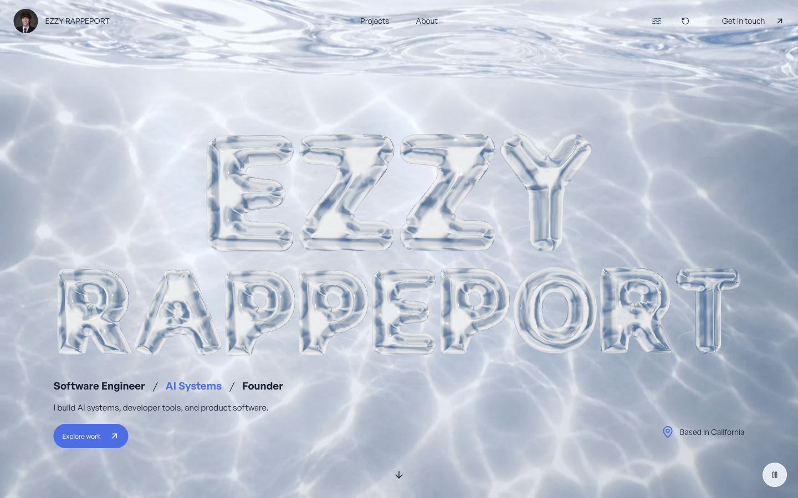
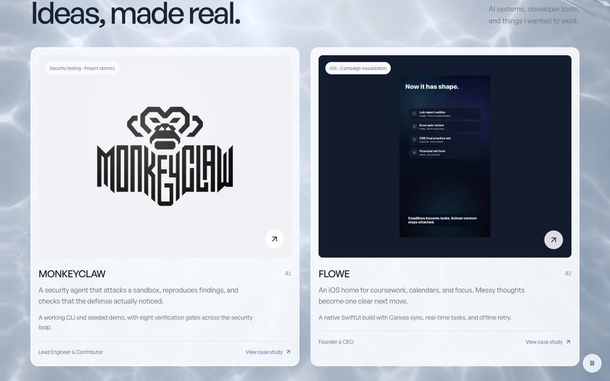
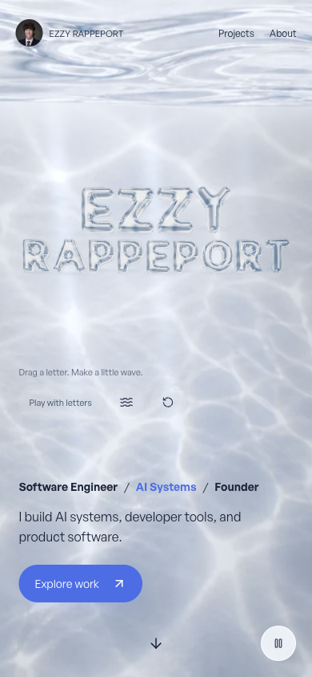

# Continuous water world

This follow-up extends the interactive water through the whole homepage. It supersedes the hero-only scope of the preceding QA report.

## What changed

- One fixed water canvas stays behind the gallery, about section, and footer. Scroll impulses disturb the surface and a gradual depth grade changes its light.
- A perspective camera and deforming overhead surface add spatial depth. Glass and water sample the same field; pointer movement changes camera angle and creates ripples.
- Project cards receive a soft pointer-positioned highlight. Leaving a card clears it. Ordinary links and document scrolling remain available.
- Letters follow their document position and disappear with the hero. The scene drops from 30 draws / 126,366 triangles to one draw / two triangles below it.
- Pause stays available throughout the homepage. It freezes autonomous movement while scroll still updates scene placement. Touch play is explicit; the rest of the page retains native scrolling.
- The transparent title and desktop/phone water fallbacks were exported from the final renderer. The title is 130,254 bytes; source provenance includes the perspective camera, canopy, and scene code.

## Browser checks

The current checkout was exercised in the local in-app WebGL browser at 1440×900 and 390×844. Verified the hero, project cards, footer, cursor lighting, touch dragging without page movement in play mode, pause while scrolling, reduced-motion fallback, and graphics-context-loss fallback. Reduced motion and context loss remove the canvas and retain loaded fallback images. Phone layout has no horizontal overflow. Opening the MonkeyClaw case study removes the canvas.

The production build was then launched from this checkout. Wave controls, scrolling, pause/resume, fixed canvas placement, and the one-draw rendering path below the hero were checked again. The normal preview was restored with no debug/export UI, touch emulation, or reduced-motion override.

At the preview's native 682×1477 viewport, DPR 1.75, a production sample below the hero reported active frame interval median/p95 of 16.7/16.8ms, CPU p95 0.7ms, GPU p95 5.26ms. Idle median/p95 was 33.3/50ms. These are local observations under tool activity, not sustained frame-rate guarantees. Physical phones and Safari remain untested.

## Validation

Passed `npm run typecheck`, `npm run lint`, `npm run test:playground`, `npm run build`, and `git diff --check`. The build generated all 31 pages. Production HTTP checks passed nine routes, 32 local assets, section anchors, and unknown-project 404 behavior. Tests cover spring/contact dynamics, wave stability, responsive perspective framing, drag-plane round trips, render budgets, and final poster provenance.

The legacy portfolio test's existing punctuation failure remains documented in the README. Temporary image-export API and capture files were removed. No commit, push, deployment, or production-hosting change was made.

