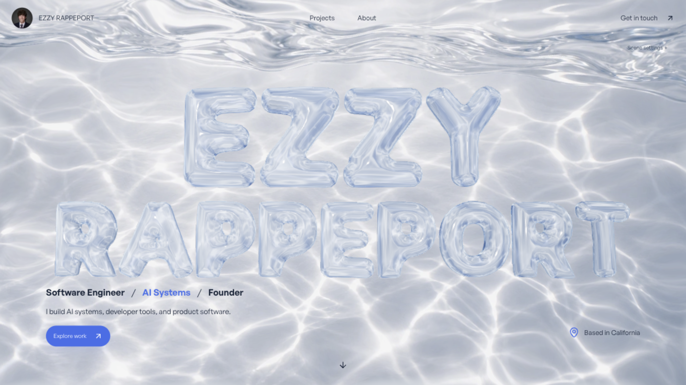
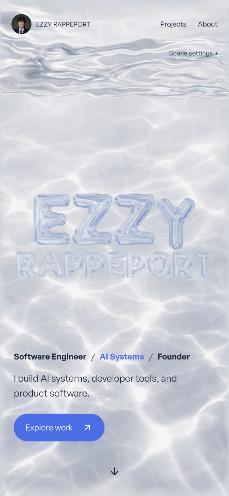

# Reference-matched portfolio, September 7

The reference image is `/Users/ezzyrappeport/Downloads/image(33).png`. The actual homepage now uses the water-study renderer inside the complete portfolio, including its existing navigation, gallery, biography, résumé, and case studies. `/water-study` shows the same integrated page.

## Appearance

The desktop title is upright, spans approximately 85% of the frame, and uses two closely stacked lines above the introduction. The header, blue exploration button, role line, and California label follow the reference composition. Mobile enlarges the first name independently while retaining the full surname within the viewport.

The water plate preserves the reference's silver-blue lighting, upper reflective surface, and fine caustics. Live water normals and pressure distort it; real GLB geometry supplies independently moving glass letters, transmission, reflection, and shadows. The glass uses broad white reflection bands and restrained blue absorption. Full-resolution HDR buffers, half-float pressure/gradients, and a shallow depth-layer refraction replace the previous quantized ray march. These remain raster optical approximations, not path-traced glass or a volumetric fluid solver.

## Browser observations

- Desktop 1440×810 inspected in Chrome and the in-app browser; mobile 390×844 inspected at DPR 2.
- Dragging picked `line1_E_00` and produced approximately 0.338 local units of displacement before release. Pause/reset restore a stable resting image.
- The keyboard event handler moved a letter by approximately 0.122 units after an ArrowRight input. This was a dispatched browser keyboard event, not physical keyboard hardware evidence.
- Mobile has no horizontal overflow. Touch-play changes touch action to `none`; returning to scrolling restores `pan-y`. Mouse dragging was exercised at mobile dimensions. Native touch injection is unavailable in this in-app browser, so no physical-touch claim is made.
- Projects and About anchors scroll to their sections. The renderer reports `offscreen` below the hero. WebGL context loss removes the canvas and visibly retains the matching mobile poster and navigation.
- Reduced-motion preference was exercised; the paused scene remains available. Save-Data's explicit early-return branch is preserved, but overriding the browser's connection API before navigation was unavailable in this tool session.
- The in-app desktop sample reported active frame median 16.7 ms, p95 17.3 ms, and GPU p95 12.28 ms; idle median 33.3 ms, p95 33.4 ms, GPU p95 13.24 ms. A separate Chrome sample had idle p95 49.6 ms. These are local samples, not guaranteed frame rates. Resting draws are 18 calls / 62,410 triangles; changing glass shadows add another geometry pass.

## Checks

Typecheck, lint, optical/refraction tests, coupled-wave dynamics, poster source hashes, playground physics, and the 14 retained-renderer runtime audit checks pass. `npm run test:portfolio` still fails the pre-existing em-dash assertion in `src/lib/portfolio/content.ts:766`; the same line exists in HEAD. That unrelated copy has not been changed.

The final production build passes and generates 32 pages. The running production server passes nine routes, 32 image/script/download assets, section anchors, and unknown-project 404 checks. `/water-study` and all three current water assets also return HTTP 200. The final fallback blend was checked at a narrow 613×837 desktop viewport; all lettering remains visible without a rectangular image boundary. No commit, push, deployment, domain change, or physical-phone test is included.

## Generated water asset

Built-in image generation edited the supplied reference, producing `public/assets/hero/reference-water-v1.webp`. The original generated PNG remains in the tool's generated-images folder. The project asset is an artwork plate, not a product screenshot. Live desktop/mobile posters were exported from the final renderer and encoded with `scripts/encode-water-hero-posters.mjs`; their source hashes are recorded in `public/assets/hero/water-hero-poster.json`.

Exact generation prompt:

> Use case: precise-object-edit. Asset type: clean background texture for an interactive 3D portfolio. Edit this exact reference image: remove ALL typography including the enormous glass EZZY RAPPEPORT lettering, all UI, all icons, portrait, links, buttons, and all words. Reconstruct the clean silver-blue sunlit underwater scene seamlessly underneath everything removed. Preserve the exact beautiful photographic pale silver blue water, the reflective rippling surface in the upper 18% and the brilliant organic caustic lighting across the floor, natural optical depth and slight background defocus. NO letters, shapes shaped like letters, text, UI, objects, logos. Only water and light. Keep exact 16:9 framing and lighting of the reference. High resolution detailed photographic water, natural caustics not a repetitive geometric pattern.
